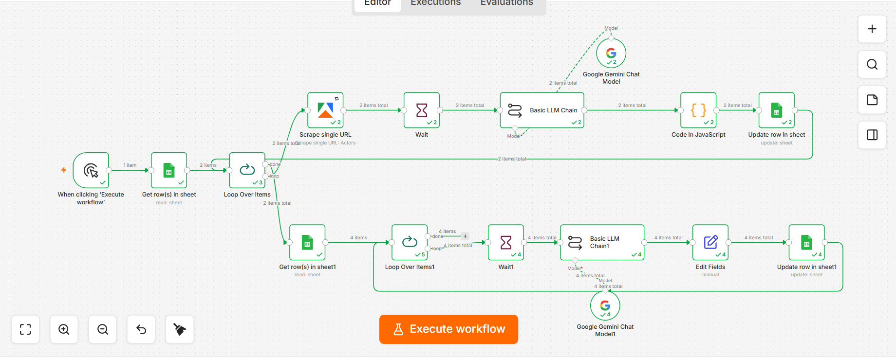
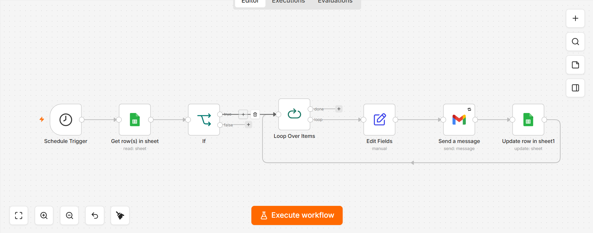

# AI-Powered Lead Outreach Automation

An AI-powered B2B lead outreach automation workflow built with n8n, Google Sheets, Google Gemini API, and Gmail.

## 🚀 Overview

This project automates the process of generating personalized outreach emails for potential leads.

The workflow takes lead information from Google Sheets, processes the data using n8n, uses Google Gemini API to generate personalized email content, and prepares/sends the outreach email through Gmail.

## 🔄 Workflow

Google Sheets
↓
n8n
↓
Lead Data Processing
↓
Google Gemini API
↓
Personalized Email Generation
↓
Gmail

## 🛠️ Technologies Used

- n8n
- Google Sheets
- Google Gemini API
- Gmail
- REST API
- Workflow Automation
- AI Automation
- Email Automation

## ✨ Key Features

- Automated lead processing
- AI-generated personalized outreach
- Google Sheets integration
- Gemini API integration
- Gmail integration
- Automated workflow execution
- Personalized B2B email generation

## 📸 Workflow Preview

### Workflow 1

### Workflow 2

## 📂 Project Files

- `SS1.png` — Workflow 1 screenshot
- `SS2.png` — Workflow 2 screenshot
- `Apollo Data MMTI Email Marketing WorkflowFlow1.json` — Workflow 1 n8n export
- `Apollo Data MMTI Email Marketing WorkflowFlow22.json` — Workflow 2 n8n export

## 🔐 Security

No API keys, passwords, OAuth credentials, or private client information are included in this repository.

## 👨‍💻 Author

Shahzaib Shoukat

Computer Science Lecturer | AI & Automation Specialist
